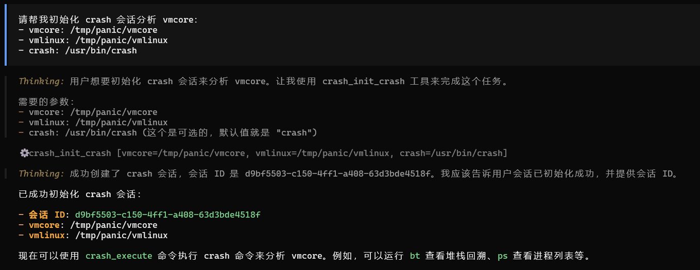
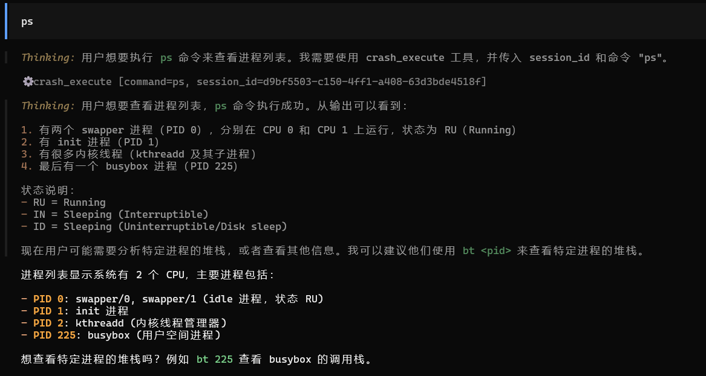
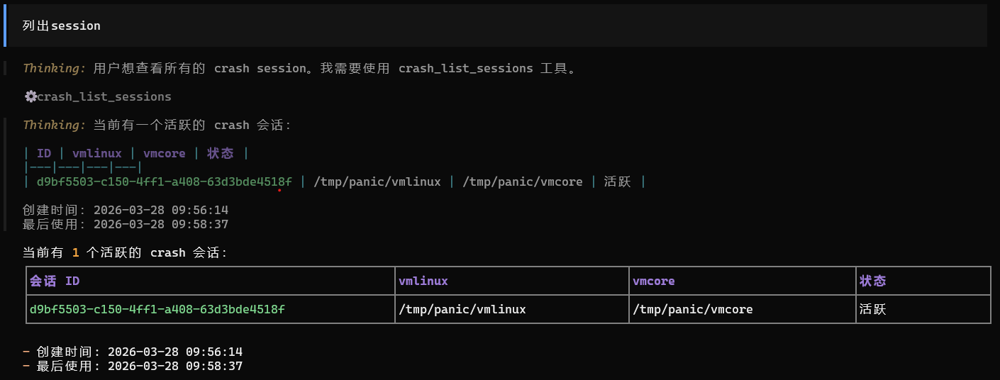
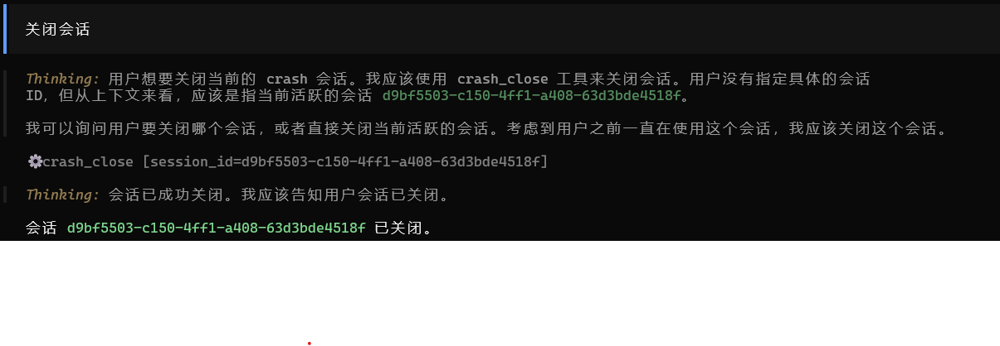

# Crash MCP Server

English | [中文](README.md)

This service addresses the efficiency bottleneck when large language models directly invoke crash, where **each command requires restarting the process and reloading vmcore (taking several minutes)**. By using a PTY pseudo-terminal to launch and keep the crash process running persistently, the service maintains crash's loaded symbol tables and kernel data structures in memory. Large language models submit commands via the MCP protocol, and the service transparently forwards them to the background process, returning output in real-time. This avoids the overhead of process recreation and vmcore reloading, reducing response latency from minutes to seconds, while supporting concurrent session management for multiple dump files.

## Features

- Multi-session management (analyze multiple vmcores simultaneously)
- Persistent crash process, avoiding repeated startup
- Command timeout protection (5 minutes)
- Automatic cleanup of expired sessions
- Complete logging

## Installation

```bash
make build                    # Compile
make install                  # Install to ~/.local/bin/
make install PREFIX=~/.local  # Install to user directory
sudo make install             # Install to /usr/local/bin
```

Uninstall:
```bash
sudo make uninstall
```

## Usage

### Example

After configuring `opencode/claudecode`, create a **crash session** using a prompt like:
```
Please help me initialize a crash session to analyze vmcore:
- vmcore: /path/to/vmcore
- vmlinux: /path/to/vmlinux
- crash: /path/to/crash
```

### Client Configuration

**ClaudeCode:**
```json
{
  "mcpServers": {
    "crash": {
      "command": "/path/to/crash-mcp",
      "args": ["--log-file", "/tmp/crash-mcp.log"]
    }
  }
}
```

**opencode:**
```json
{
  "mcp": {
    "crash": {
      "type": "local",
      "command": ["/path/to/crash-mcp", "--log-file", "/tmp/crash-mcp.log"],
      "enabled": true
    }
  }
}
```

## MCP Tools

### 1. **init_crash** - Initialize Session
   ```json
   {"crash": "/usr/bin/crash", "vmlinux": "/path/vmlinux", "vmcore": "/path/vmcore"}
   ```
   Returns: `{"session_id": "uuid"}`

  

### 2. **execute** - Execute Command
   ```json
   {"session_id": "uuid", "command": "bt"}
   ```

  

### 3. **list_sessions** - List All Sessions
   ```json
   {}
   ```
   Returns: Array of session information
   ```json
   [
     {
       "id": "uuid-string",
       "vmlinux": "/path/to/vmlinux",
       "vmcore": "/path/to/vmcore",
       "created": "2024-01-01T00:00:00Z",
       "last_used": "2024-01-01T00:00:00Z",
       "active": true
     }
   ]
   ```

  

### 4. **close** - Close Session
   ```json
   {"session_id": "uuid"}
   ```

  
